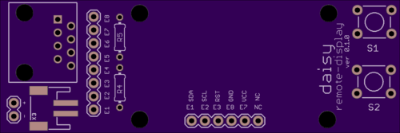

#daisy

## arrangement

# datalogger

Top:

Bottom:

- programmed via FTDI cable, board = "Arduino UNO"
- estimated < 100 microAmp sleep current
- DS1337 RTC with battery backup
- i2c EEPROM, 512KB storage
- RJ45 connector for 8-wire CAT-5,6,7 cable
- pin headers allow for patching RJ45 to digital / analog / power / ground
- JST header for battery power (or use remote)

# remote

Top:

Bottom:

- RJ45 connector
- JST header for battery power (or use remote)
- RJ45 pins broken out via header for custom patching
- 3 LEDs connected to ethernet pins 1,2,3 (if placed)
- 2 momentary buttons connected to ethernet pins 4,5 (if placed)
- mounting holes 

# remote w/ display

Replaces LEDs with a 128x32 OLED display from Adafruit:

Top:

Bottom:

To hook up [Adafruit OLED display](https://www.adafruit.com/products/931):

- 3.3V  OLED VIN.
- GND to OLED ground (GND).
- I2C SCL (A5) to OLED SCL.
- I2C SDA (A4) to OLED SDA.
- digital 4 to OLED RST.
- these pins are marked on the remote-display board.  Proper relevant patching must be done on the logger, to match.

# ref

http://pinouts.ru/NetworkCables/ethernet_10_100_1000_pinout.shtml

